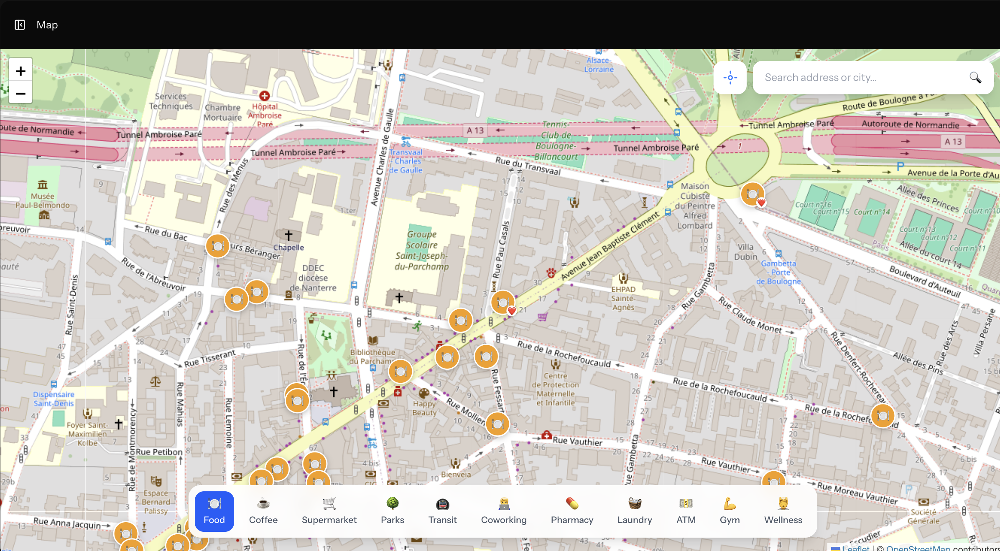
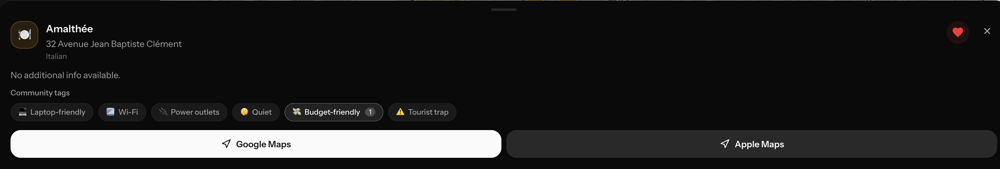
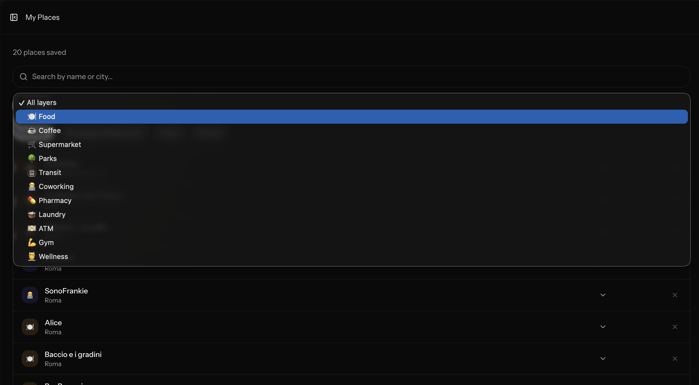

> Explore a neighborhood like a local, not a tourist.

Spotly is a map app for slow travelers. Instead of showing you the usual generic points of interest, it helps you discover the neighborhood you're in: where to eat, where to work, where to shop, where to catch public transport — all filtered by category with real-time data from OpenStreetMap.


---

## Features

- **Interactive map** with layer toggle by category (Food, Coffee, Supermarket, Parks, Transit, Coworking, Pharmacy, Laundry, ATM, Gym, Wellness)
- **City search** via Nominatim (OpenStreetMap geocoding)
- **POI card** with details, opening hours, website, phone, and directions
- **Save places** with personal notes
- **Community tags** on POIs: users can add collaborative tags (`laptop_friendly`, `wifi`, `power_outlets`, `quiet`, `budget_friendly`, `tourist_trap`)
- **My Places**: paginated and filterable list of saved places
- **Dashboard** with personal stats: saved places, cities explored, favorite layer

---

## Tech Stack

| Layer | Technology |
|---|---|
| Backend | PHP 8.4 + Laravel 12 |
| Frontend | Vue 3 + Inertia.js v2 |
| Styling | Tailwind CSS v4 |
| Map | Leaflet.js + OpenStreetMap |
| POI data | Overpass API (OpenStreetMap) |
| Geocoding | Nominatim API |
| Auth | Laravel Fortify |
| Database | SQLite (development) / PostgreSQL (production) |
| POI Cache | DB with 24h TTL |
| Cache / Queue | Redis (production) |

---

## Screenshots

| Map | POI Card | My Places |
|---|---|---|
|  |  |  |

---

## Installation

### Requirements

- PHP 8.4
- Composer
- Node.js 20+
- Laravel Herd (or any local PHP server)

### Setup

```bash
# 1. Clone the repository
git clone https://github.com/eugeniogiusti/spotly.git
cd spotly

# 2. Install PHP dependencies
composer install

# 3. Install JS dependencies
npm install

# 4. Configure the environment
cp .env.example .env
php artisan key:generate

# 5. Create the database and run migrations
touch database/database.sqlite
php artisan migrate

# 6. Build assets
npm run build

# 7. Start the server (or use Herd)
php artisan serve
```

---

## Performance Notes

### First-time layer loading
The first time you activate a layer in a new area, Spotly fetches data live from the **Overpass API** (OpenStreetMap). This request can take up to ~10 seconds depending on Overpass server load. Subsequent requests for the same area are served from the local DB cache (24h TTL) and are near-instant.

### Recommended production setup
For the best performance in production, use **PostgreSQL + Redis**:

- **PostgreSQL** handles large POI datasets more efficiently than SQLite, with proper indexing on bbox queries (`lat`, `lng`, `layer`).
- **Redis** as the Laravel cache driver avoids repeated DB lookups for session, config, and route caching.

Set in `.env`:
```env
DB_CONNECTION=pgsql
CACHE_STORE=redis
SESSION_DRIVER=redis
REDIS_HOST=127.0.0.1
REDIS_PORT=6379
```

---

> **Note:** this project is under active development. There may be bugs or incomplete features.
